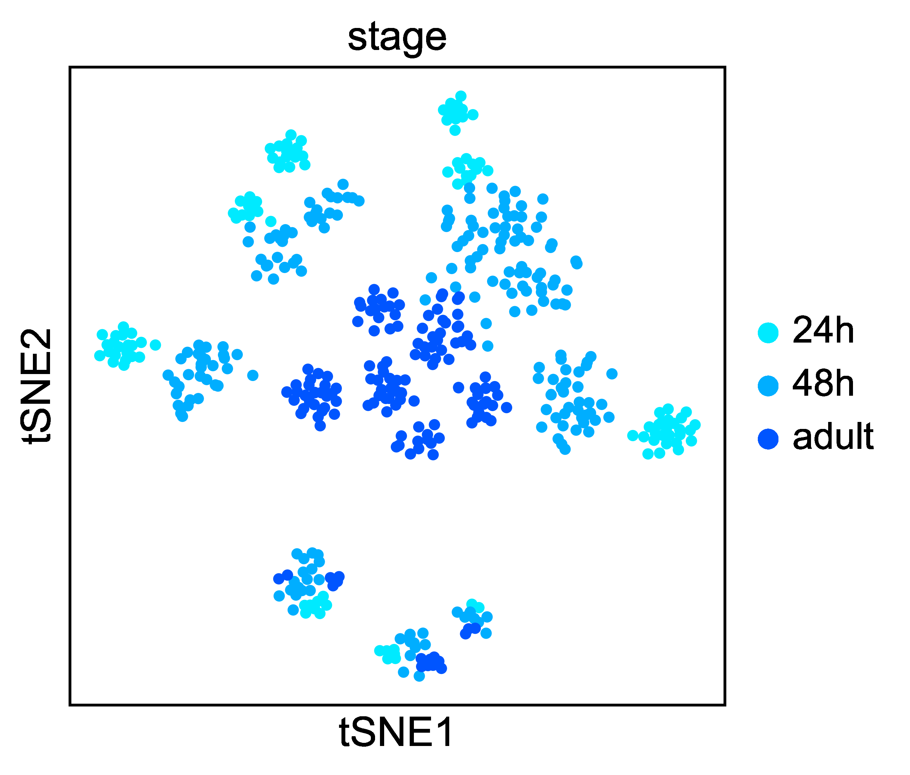
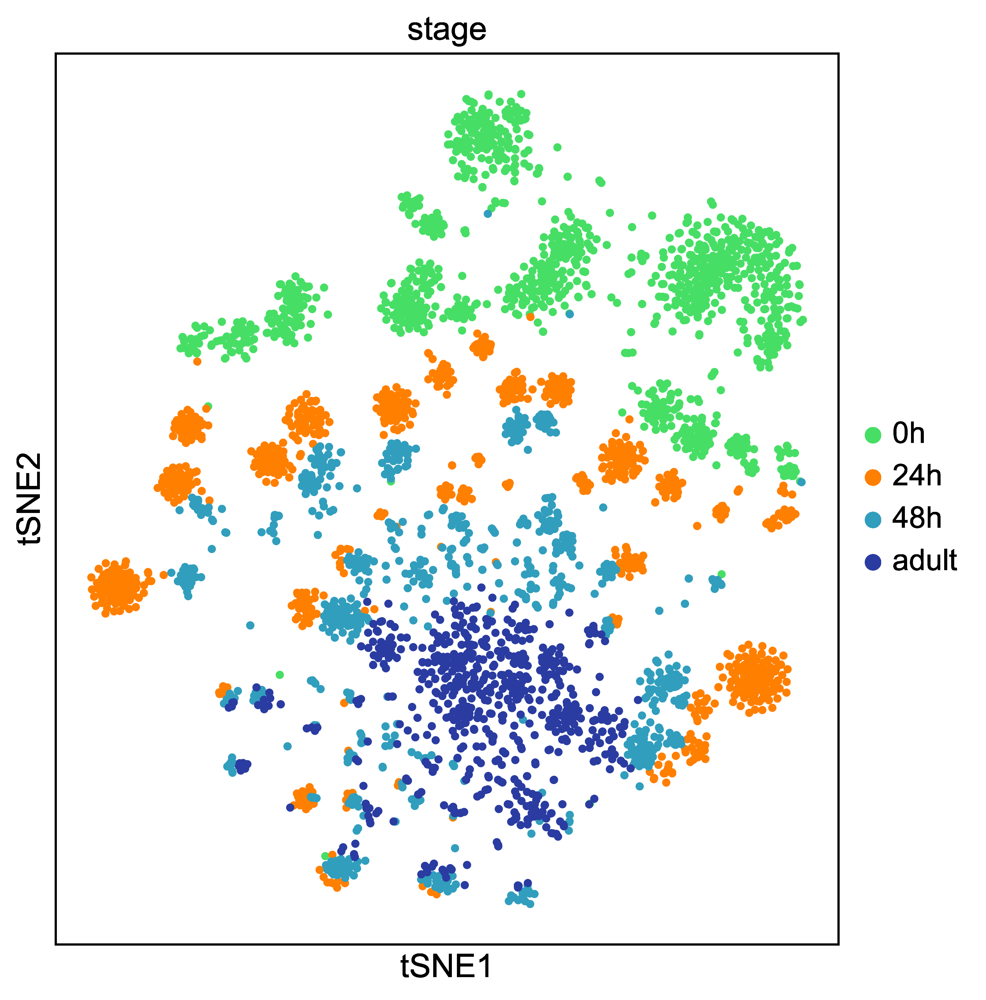

# FlyPN_development
Analysis workflow for [Xie et al. 2020](https://www.biorxiv.org/content/10.1101/2020.09.24.312397v1.full)

This repository contains Jupyter Notebooks that were used to analyze the scRNA-seq data of Drosophila Olfactory Projection Neurons (PN) at 4 different developmental stages.

# Configuration
### Enviroment
Analysis requires [Scanpy](https://scanpy.readthedocs.io/en/stable/), [anndata](https://anndata.readthedocs.io/en/stable/anndata.AnnData.html), [ICIM](https://github.com/felixhorns/FlyPN), and [MARS](https://github.com/snap-stanford/mars). ICIM was modified to run in Python 3.7 environment.

### Notebooks
Code for analyzing the data and reproducing the figures shown in the paper.

### Data
Sequencing reads and preprocessed sequence data are available in the NCBI Gene Expression Omnibus (GSE161228, https://www.ncbi.nlm.nih.gov/geo/query/acc.cgi?acc=GSE161228).
Data have been preprocessed to keep only high quality neurons and normalized via the transformation Log2(CPM+1). The expression data and annotations are stored as anndata objects are used as inputs for analysis.

   
   

Left: knot+ PNs at three pupal stages. Right: most PNs at four stages.

# Contact
Please contact ChiChi at cqxie@stanford.edu for questions.
